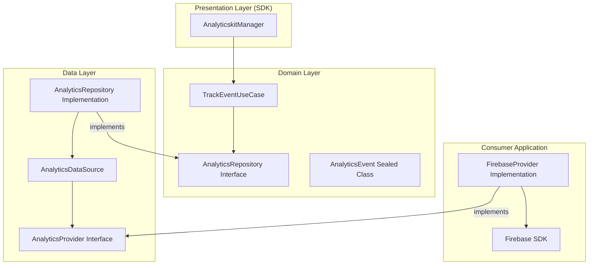

# Analyticskit

**"Turn user behavior into strategic insights."**

Analyticskit is a modular tool built for data collection and user behavior analysis. It streamlines the tracking of custom events, screen navigation, and conversion funnels, featuring a flexible architecture that allows sending data to multiple providers (Firebase, Mixpanel, or custom backends) simultaneously.

## 🚀 Key Features

- **Multi-Provider Support**: Route data to multiple analytics consumers (Firebase, Mixpanel, etc.) simultaneously.
- **Rich Event Tracking**: Track custom events with detailed metadata.
- **Navigation Monitoring**: Automatic or manual tracking of screen views and user flow.
- **Conversion Funnels**: Specialized tracking for business-critical user journeys.
- **Clean Architecture**: Decoupled business logic from specific provider implementations.
- **Hilt Ready**: Full support for Dependency Injection for easy integration.
- **Agnostic & Lightweight**: Zero required third-party dependencies in the core library.

## 🏗 Architecture

Analyticskit follows **Clean Architecture** to ensure isolation of tracking logic and ease of expansion to new analytics platforms.



## 🛠 Usage Example

### 1. Implement a Provider
Create a bridge between Analyticskit and your preferred service.

```kotlin
class ConsoleAnalyticsProvider : AnalyticsProvider {
    override val key: String = "CONSOLE"

    override suspend fun track(event: AnalyticsEvent) {
        when (event) {
            is AnalyticsEvent.Custom -> println("Event: ${event.name}")
            is AnalyticsEvent.ScreenView -> println("Screen: ${event.screenName}")
            is AnalyticsEvent.FunnelStep -> println("Funnel: ${event.funnelName} Step: ${event.stepName}")
        }
    }
}
```

### 2. Initialize and Inject
Add your providers to the `AnalyticskitManager` (usually in your `Application` class).

```kotlin
@HiltAndroidApp
class MyAwesomeApp : Application() {
    @Inject lateinit var analyticskitManager: AnalyticskitManager

    override fun onCreate() {
        super.onCreate()
        analyticskitManager.addProvider(ConsoleAnalyticsProvider())
    }
}
```

### 3. Track Events
Use the manager to record data from anywhere in your app.

```kotlin
// Track a custom event
analyticskitManager.track(
    AnalyticsEvent.Custom("purchase_completed", mapOf("amount" to 99.99))
)

// Track screen navigation
analyticskitManager.track(
    AnalyticsEvent.ScreenView("CheckoutScreen")
)
```

## 📂 Project Structure

- `:analyticskit`: The core library module.
    - `sdk`: Public API (`AnalyticskitManager`).
    - `domain`: Business logic, Repository interfaces, and `AnalyticsEvent` models.
    - `data`: Repository implementation, DataSources, and Provider abstractions.
- `:showcase`: A sample app demonstrating integration, Hilt usage, and provider implementation.

## 🧪 Quality Assurance

- **KDocs**: 100% API documentation for public members.
- **Unit Testing**: High logic coverage using **JUnit**, **MockK**, and **Coroutines Test**.
- **Performance**: Thread-safe provider management and low-overhead event dispatching.

---

*Developed with focus on scalability and data precision.*
