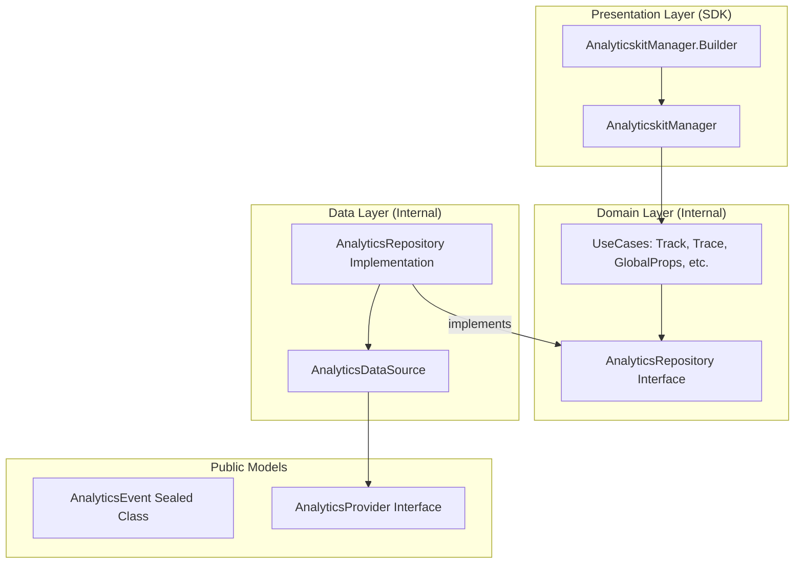

# Analyticskit

**"Turn user behavior into strategic insights."**

Analyticskit is a modular tool built for data collection and user behavior analysis. It streamlines the tracking of custom events, screen navigation, and conversion funnels, featuring a flexible architecture that allows sending data to multiple providers (Firebase, Mixpanel, or custom backends) simultaneously.

## 🚀 Key Features

- **Multi-Provider Support**: Route data to multiple analytics consumers simultaneously.
- **Dynamic Management**: Add or remove providers at runtime.
- **Global Properties**: Set properties that apply to all events or specific providers.
- **Event Tracing**: Accumulate data across multiple screens before sending a final consolidated event.
- **Clean Architecture**: Internalized business logic with a public-facing simplified API.
- **Zero Dependencies**: Hilt-free, lightweight, and thread-safe.
- **Synchronous API**: Fire-and-forget calls with internal coroutine management.

## 🏗 Architecture

Analyticskit follows **Clean Architecture** to ensure isolation of tracking logic and ease of expansion.



## 🛠 Usage Example

### 1. Initialize the Manager
Use the `Builder` to create a singleton instance.

```kotlin
val analyticsManager = AnalyticskitManager.Builder()
    .addProvider(MyAnalyticsProvider())
    .build()
```

### 2. Global Properties
Set properties once, send them everywhere.

```kotlin
analyticsManager.addGlobalProperty("user_type", "premium")
```

### 3. Event Tracing (Agregated Data)
Collect data from different screens and send it when ready.

```kotlin
// Screen 1
analyticsManager.traceEvent("purchase_flow", mapOf("item_id" to "123"))

// Screen 2
analyticsManager.traceEvent("purchase_flow", mapOf("payment_type" to "card"))

// Final Screen - Sends consolidated event and clears trace
analyticsManager.trackTracedEvent("purchase_flow")
```

### 4. Simple Tracking
```kotlin
analyticsManager.track(AnalyticsEvent.Custom("button_clicked"))
```

## 🧪 Quality Assurance

- **Internal Logging**: Errors are automatically logged to Logcat via `AnalyticskitManager` TAG.
- **Thread Safety**: Uses `ConcurrentHashMap` and `CopyOnWriteArrayList` for safe multi-threaded access.
- **Unit Testing**: Full coverage of UseCases and Manager logic.

---

*Developed with focus on scalability and data precision.*
