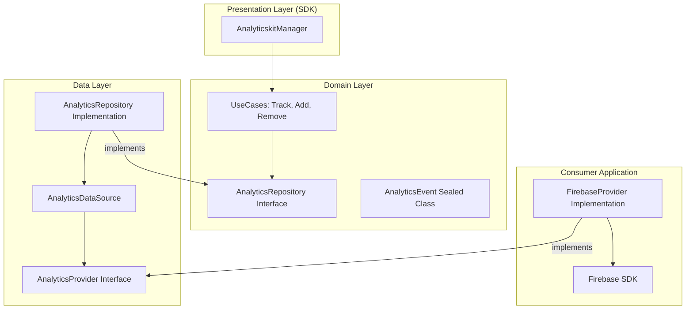

# Analyticskit

**"Turn user behavior into strategic insights."**

Analyticskit is a modular tool built for data collection and user behavior analysis. It streamlines the tracking of custom events, screen navigation, and conversion funnels, featuring a flexible architecture that allows sending data to multiple providers (Firebase, Mixpanel, or custom backends) simultaneously.

## 🚀 Key Features

- **Multi-Provider Support**: Route data to multiple analytics consumers (Firebase, Mixpanel, etc.) simultaneously.
- **Dynamic Management**: Add or remove providers at runtime based on user preferences or app state.
- **Rich Event Tracking**: Track custom events, screen views, and conversion funnels with type-safe models.
- **Clean Architecture**: Strict separation of concerns with a UseCase-driven approach.
- **Hilt Ready**: Seamless dependency injection for Android applications.
- **High Performance**: Optimized for low overhead using structured concurrency and thread-safe collections.

## 🏗 Architecture

Analyticskit follows **Clean Architecture** to ensure isolation of tracking logic and ease of expansion to new analytics platforms.



## 🛠 Usage Example

### 1. Implement a Provider
Create a bridge between Analyticskit and your preferred service by implementing `AnalyticsProvider`.

```kotlin
class ConsoleAnalyticsProvider : AnalyticsProvider {
    override val key: String = "CONSOLE_PROVIDER"

    override suspend fun track(event: AnalyticsEvent) {
        when (event) {
            is AnalyticsEvent.Custom -> println("Event: ${event.name}")
            is AnalyticsEvent.ScreenView -> println("Screen: ${event.screenName}")
            is AnalyticsEvent.FunnelStep -> println("Funnel: ${event.funnelName}")
        }
    }
}
```

### 2. Initialize and Manage Providers
Inyect `AnalyticskitManager` and manage your providers dynamically.

```kotlin
@HiltAndroidApp
class MyApp : Application() {
    @Inject lateinit var analyticskitManager: AnalyticskitManager

    override fun onCreate() {
        super.onCreate()
        // Add provider
        analyticskitManager.addProvider(ConsoleAnalyticsProvider())
    }
}
```

### 3. Track Events
Track data from any part of your application.

```kotlin
// Track a custom event globally
analyticskitManager.track(
    AnalyticsEvent.Custom("purchase_completed", mapOf("price" to 19.99))
)

// Target a specific provider
analyticskitManager.track(
    event = AnalyticsEvent.Custom("debug_event"),
    providerKey = "CONSOLE_PROVIDER"
)
```

## 📂 Project Structure

- `:analyticskit`: The core library module.
    - `sdk`: Public API (`AnalyticskitManager`).
    - `domain`: Business logic, `UseCase` interfaces, and `AnalyticsEvent` models.
    - `data`: Repository implementation, thread-safe `DataSource`, and `Provider` abstractions.
- `:showcase`: A sample app demonstrating dynamic provider toggling and event tracking.

## 🧪 Quality Assurance

- **KDocs**: 100% API documentation for public members.
- **Unit Testing**: 100% logic coverage using **JUnit 4**, **MockK**, and **Coroutines Test**.
- **Performance**: Thread-safe provider management using `CopyOnWriteArrayList` and optimized `flowOn(Dispatchers.IO)`.

---

*Developed with focus on scalability and data precision.*
